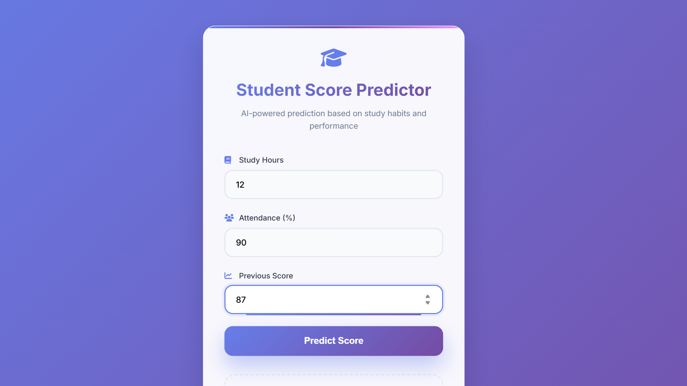
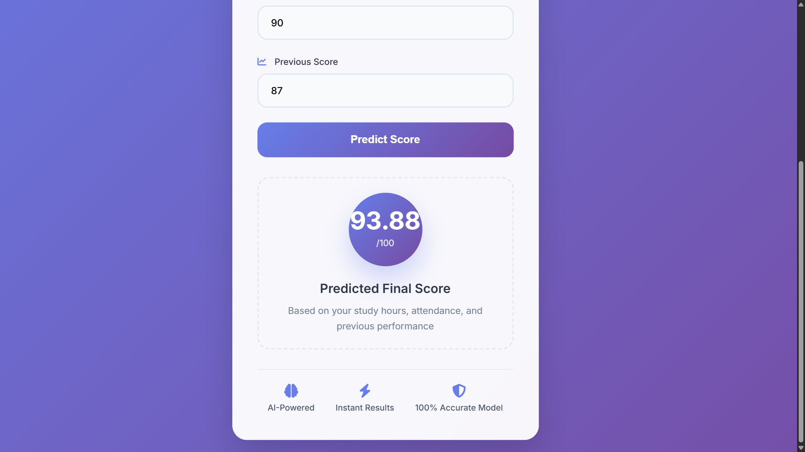

# 📊 **Student Score Predictor**  
### *AI-Powered Prediction Based on Study Habits and Performance*

The **Student Score Predictor** is an AI-driven web application that forecasts a student's final score using three important factors:  
- **Study Hours**  
- **Attendance (%)**  
- **Previous Score**

It uses a trained **Machine Learning Regression Model** to generate fast and accurate predictions inside a modern, gradient-based UI.

---

## 🖼 **User Interface Preview**

### 🧮 Input Form  


### 🎯 Predicted Score Output  


---

## 🚀 **Features**

### 🎓 **Multi-Factor Prediction**
Predicts final academic performance using:
- Study behavior  
- Attendance consistency  
- Past exam performance  

### ⚡ **Instant Score Calculation**
Get predicted results instantly after clicking **Predict Score**.

### 🧠 **AI/ML Regression Model**
Developed using:
- Scikit-Learn  
- Pandas  
- NumPy  

### 🎨 **Beautiful & Modern UI**
Crafted with a premium-looking purple gradient theme:
- Floating input fields  
- Clean output container  
- Smooth UI animations  

### 🔐 **Secure Local Execution**
No cloud uploads — all predictions run locally.

---

## 🛠 **Tech Stack**

### **Frontend**
- HTML  
- CSS / Tailwind  
- JavaScript  

### **Machine Learning**
- Python  
- Scikit-Learn  
- Pandas  
- NumPy  

### **Backend / Runtime**
- Streamlit  
or  
- Flask  

---


## ⚙️ **How to Run**

### **1️⃣ Install Dependencies**
```bash
pip install -r requirements.txt
```

### **2️⃣ Run Application**

For Python:
```bash
python app.py
```

For Streamlit:
```bash
streamlit run app.py
```

---

## 👨‍💻 Author

**Ritesh Mendhe**

Blockchain Developer | Full Stack Developer | Web3 Enthusiast  

LinkedIn  
https://www.linkedin.com/in/ritesh-mendhe-209225294  

GitHub  
https://github.com/riteshmendhe2602  

---

⭐ If you like this project, give it a **star on GitHub**.


